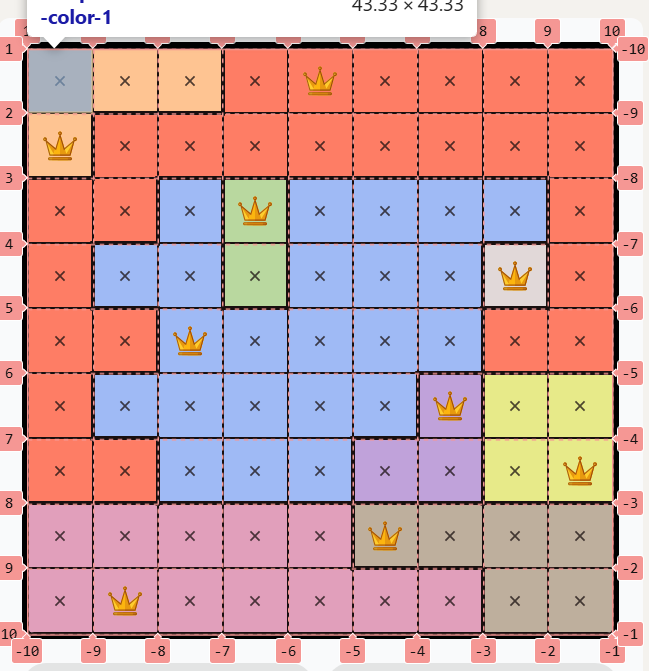

# LinkedIn Queens game
- [ ] extract the main logic into a function
- [ ] a cli to autoclick the cells with the help of image recognition or getting
  the board from the site somehow, just found out it can be parsed from the site
  html 
  - [ ] parse the html with the help of reqwest, scraper
    - [ ] press "start game" to see the board
- [ ] cli to take input of the board(purple, green,.. )
- [ ] build a board from image
- [ ] api to take input of the board from the website (from html or image)
- [ ] add frontend with a backend server
it'll for now show solution only
later it'll be playable with hints, so rules will be applied
it'll be a csr app